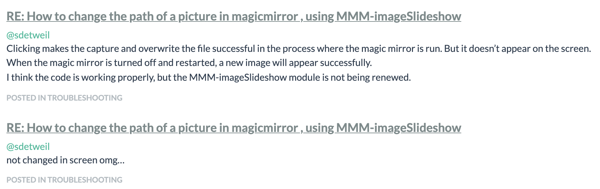
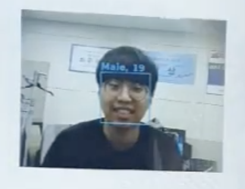

# Intro

- 오픈소스[Magicmirror↗️](https://magicmirror.builders/)를 활용한 스마트미러이다.

- 스마트미러를 목표로 제작하였지만, 여러 이유때문에 <span style="color:red">**거울필름을 사용하지않고 카메라로 거울역할**</span>을 대체하였다.
  
- 제작한 스마트미러는 총 2가지 종류이다.
	
	- 미용실용 스마트미러: [BeautyMirror↗️](https://github.com/ENTITYSmartMirror/BeautyMirror)  
	- 공항용 스마트미러: [AirportMirror↗️](https://github.com/ENTITYSmartMirror/AirportMirror) 

## 순서도
 

## 실행 유튜브 영상
- 하단 이미지 클릭시 재생   
[](https://youtu.be/DuVUfmSpNm8?t=0s) 


## 오픈소스 포럼 프로필 및 질문 내역들
- 질문 예시

- https://forum.magicmirror.builders/user/emrhssla

## 설치방법
1. node.JS 설치
2. 저장소로부터 파일 다운로드 - `git clone https://github.com/ENTITYSmartMirror/BeautyMirror.git`
3. repository 진입 - `cd {repository}`
4. 앱 설치 - `npm install`
5. 앱 시작 - `npm run start`

**cf) 사진 찍기 기능을 이용하려면 opencv 설치필요**
1. 가상환경 접속 
2. `pip install --upgrade pip`
3. `pip install opencv-python`


# 개발문서


- ## 페이지 1. 카메라로 거울 기능

> opencv 설치필요 X, 카메라 접근권한 허용 필요

| 모듈이름             | 기존모듈    | 기능                                                      | ❗️코딩내용 |비고  |
| --------        | ------ | ------------------------------------------------------------ | ------- |-----|
| **camera**   | [camera](https://github.com/alexyak/camera/)   | 카메라띄우기       |[camera module custom](https://github.com/ENTITYSmartMirror/BeautyMirror/commit/d4ffce5d281206308f708cd72624b06e304188ba?diff=unified) | mm-hide-all와 연동됨 |
| **mm-hide-all**   | [mm-hide-all](https://github.com/AlexDespain01/mm-hide-all) | 카메라 전체화면/기존화면 토글 버튼| [hide button custom](https://github.com/ENTITYSmartMirror/BeautyMirror/commit/d4ffce5d281206308f708cd72624b06e304188ba?diff=unified)| hide-all에서 모든 모듈 가리기에서 카메라 확대로 바꿈 |   
| **MMM-DeleteImage**   | [mm-hide-all](https://github.com/AlexDespain01/mm-hide-all)  | 사진데이터 삭제 / 모든 모듈 재시작 및 초기화 | [Make DeleteImage and default all modules](https://github.com/ENTITYSmartMirror/BeautyMirror/commit/f6c2d71bc0cdf31f3ef9c25807ff22665ae6b0d9)| python-shell  필요 |


- ## 페이지 2. 헤어스타일 사진 목록
  2021.01.01 기준으로 사진 안뜸 -> AWS EC2 서비스 종료


- ## 페이지 3. 얼굴나이 인식을 하여 사용자 나이 정보에 맞는 헤어스타일 추천
  2021.01.01 기준으로 얼굴인식 안됨 -> Azure Face API 종료

| 모듈이름             | 기존모듈    | 기능                                                      | ❗️코딩내용 |비고  |
| --------        | ------ | ------------------------------------------------------------ | ------- |-----|
| **MMM-Testpython**   | 처음부터 개발    | 얼굴인식하여 나이에 맞는 사진 출력 |[MMM-Testpython](https://github.com/ENTITYSmartMirror/BeautyMirror/tree/master/modules/MMM-Testpython) | 👉[MMM-Testpython.js](https://github.com/ENTITYSmartMirror/BeautyMirror/blob/master/modules/MMM-Testpython/MMM-Testpython.js)-view<br>👉[FCF.py](https://github.com/ENTITYSmartMirror/BeautyMirror/blob/master/modules/MMM-Testpython/FCF.py)<br>👉[node_helper.js](https://github.com/ENTITYSmartMirror/BeautyMirror/blob/master/modules/MMM-Testpython/node_helper.js)- 백엔드 |
| **mm-hide-all**   | [mm-hide-all](https://github.com/AlexDespain01/mm-hide-all) | 카메라 전체화면/기존화면 토글 버튼| [hide button custom](https://github.com/ENTITYSmartMirror/BeautyMirror/commit/d4ffce5d281206308f708cd72624b06e304188ba?diff=unified)| hide-all에서 모든 모듈 가리기에서 카메라 확대로 바꿈 |   
| **MMM-DeleteImage**   | [mm-hide-all](https://github.com/AlexDespain01/mm-hide-all)  | 사진데이터 삭제 / 모든 모듈 재시작 및 초기화 | [Make DeleteImage and default all modules](https://github.com/ENTITYSmartMirror/BeautyMirror/commit/f6c2d71bc0cdf31f3ef9c25807ff22665ae6b0d9)| python-shell 필요 |
| **What-age**   | [MMM-ImageSlideshow](https://github.com/AdamMoses-GitHub/MMM-ImageSlideshow)  |  얼굴인식결과 사진출력| [Whatage.js and Whatage/node_helper.js commit](https://github.com/ENTITYSmartMirror/BeautyMirror/commit/fd2f48f2be5668f680f0935368c7f0bef212a8df#diff-2737284afe2f19efb6df705585a168126c60931cb823c6712bf7fa4318904dae)| MMM-Testpython과 연결 |


- ## 페이지 4. 미용 전/후 머리스타일 비교를 위하여 사진 찍고 출력

| 모듈이름             | 기존모듈    | 기능                                                      | ❗️코딩내용 |비고  |
| --------        | ------ | ------------------------------------------------------------ | ------------- |-----|
| **MMM-BeforeImage**   | [MMM-ImageSlideshow](https://github.com/AdamMoses-GitHub/MMM-ImageSlideshow)    | 미용하기전 사진찍고 출력 |[Make BeforeImage-Module](https://github.com/ENTITYSmartMirror/BeautyMirror/commit/9e6e839966da360432b0360db426cd97fab1c120) | MMM-BeforeAfter와 연결 |
| **MMM-AfterImage**   | 개발해놓은 [MMM-BeforeImage](https://github.com/ENTITYSmartMirror/BeautyMirror/tree/master/modules/MMM-BeforeImage)응용 | 미용하고난후 사진찍고 출력| [Make AfterImage-Module](https://github.com/ENTITYSmartMirror/BeautyMirror/commit/f9153782df98ad053b4e36b6589ac83da64dba2c)| MMM-BeforeAfter와 연결 |
| **MMM-BeforeAfter**   | 처음부터 개발 | Before/AfterImage 백엔드 구현 | 👉[BeforeAfter.js](https://github.com/ENTITYSmartMirror/BeautyMirror/blob/master/modules/MMM-BeforeAfter/MMM-BeforeAfter.js)-view<br>👉[node_helper.js](https://github.com/ENTITYSmartMirror/BeautyMirror/blob/master/modules/MMM-BeforeAfter/node_helper.js)-backend<br>👉[before.py](https://github.com/ENTITYSmartMirror/BeautyMirror/blob/master/modules/MMM-BeforeAfter/before.py),[before2.py](https://github.com/ENTITYSmartMirror/BeautyMirror/blob/master/modules/MMM-BeforeAfter/before2.py)| python_shell, opencv 필요 |
| **mm-hide-all**   | [mm-hide-all](https://github.com/AlexDespain01/mm-hide-all) | 카메라 전체화면/기존화면 토글 버튼| [hide button custom](https://github.com/ENTITYSmartMirror/BeautyMirror/commit/d4ffce5d281206308f708cd72624b06e304188ba?diff=unified)| hide-all에서 모든 모듈 가리기에서 카메라 확대로 바꿈 |   
| **MMM-DeleteImage**   | [mm-hide-all](https://github.com/AlexDespain01/mm-hide-all)  | 사진데이터 삭제 / 모든 모듈 재시작 및 초기화 | [Make DeleteImage and default all modules](https://github.com/ENTITYSmartMirror/BeautyMirror/commit/f6c2d71bc0cdf31f3ef9c25807ff22665ae6b0d9)| python-shell 필요 |


- ## 페이지 5. 머리 자르면서 Youtube와 웹툰보기


| 모듈이름             | 기존모듈    | 기능                                                      | ❗️코딩내용 |비고  |
| --------        | ------ | ------------------------------------------------------------ | ------- |-----|
| **CategoryChoiceYoutube**   | [MMM-Modulebar](https://github.com/Snille/MMM-Modulebar)    | Youtube 주제선택 카테고리 |[Make CategoryChoiceYoutube](https://github.com/ENTITYSmartMirror/BeautyMirror/commit/937e7d0a10d6cf47bc04b0b076221a97ee6058d2) | MMM-EmbedYoutube1와 연결 |
| **MMM-EmbedYoutube1**   | [MMM-EmbedYoutube](https://github.com/nitpum/MMM-EmbedYoutube) | Youtube출력 | [Make EmbedYoutube1](https://github.com/ENTITYSmartMirror/BeautyMirror/commit/31aa64ea42f2bc560ae31e7d13f7025828dcabcb)| [Youtube - IFrame Player API](https://developers.google.com/youtube/player_parameters?hl=ko#playlist) 사용 |
| **CategoryChoiceEntMenu**   | [MMM-Modulebar](https://github.com/Snille/MMM-Modulebar)    | Youtube/Webtoon 선택 |[Make CategoryChoiceEntMenu](https://github.com/ENTITYSmartMirror/BeautyMirror/commit/4e34dd5b4e04d849165aaea84b6cf3901cc20d25) |  |

- ## 페이지 6. 여태껏 헤어스타일링했던 사진 보기

- ## 페이지 7. 모듈 조작하기

## 도움되는 사이트

- [CSS↗️](https://forum.magicmirror.builders/category/8/custom-css): 매직미러의 CSS관련 질문 및 개발  
- [Forum↗️](https://forum.magicmirror.builders/category/6/development) : 개발 관련 질문 포럼  
- [ModuleForBeginner↗️](https://forum.magicmirror.builders/topic/8534/head-first-developing-mm-module-for-extreme-beginners) : Module을 만드는 방법  
- [docs.magicmirror↗️](https://docs.magicmirror.builders/) : 전체적인 개발 관련 문서   


## 개발 관련 기록

- [개발을위한문법정리(기초)](https://github.com/ChanYoung-dev/mirrorPlan): nodeJS, mysql, AJAX, Dom 등등 기초 공부  
- [종합보고서](https://github.com/ENTITYSmartMirror/BeautyMirror/blob/master/%ED%95%9C%EC%9D%B4%EC%9D%8C:%EC%A2%85%ED%95%A9%EC%84%A4%EA%B3%84%20%EC%B5%9C%EC%A2%85%EB%B3%B4%EA%B3%A0%EC%84%9C.hwp):

```
I. 프로젝트 수행계획
 	1. 프로젝트 개요
   가. 프로젝트 소개
   나. 추진배경 및 필요성
   다. 자료조사
   라. 제한요소
	2. 프로젝트 내용
   가. 주요기능
   나. 개발환경
   다. 필요 기자재
   라. 동작 흐름도
   마. 제한요소
   바. 프로젝트 추진일정
	3. 프로젝트 수행방법
II. 기대효과 및 활용분야
	1. 기대효과
  2. 활용분야
III. 프로젝트 수행
  1. 홈
  2. 헤어스타일 선택
  3. 연령별 추천헤어
  4. 전후 사진 비교
  5. Cut History
  6. Entertainment
  7. 추가기능
IV. 평가
  1. 구현 달성율
  2. 문제점 및 해결방안
부록
1. 프로그램 소스코드
2. 회의록
```

- [스마트미러 논문↗️](https://github.com/ENTITYSmartMirror/BeautyMirror/blob/master/%EB%B2%94%EC%9A%A9%EC%84%B1%20%EC%8A%A4%EB%A7%88%ED%8A%B8%EB%AF%B8%EB%9F%AC%20%EB%85%BC%EB%AC%B8.hwp)

