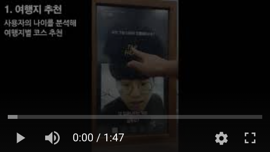

# Intro

- 오픈소스[Magicmirror↗️](https://magicmirror.builders/)를 활용한 스마트미러이다.

- 제작한 스마트미러는 총 2가지 종류이다.
	
	- 미용실용 스마트미러: [BeautyMirror↗️](https://github.com/ENTITYSmartMirror/BeautyMirror)  
	- 공항용 스마트미러: [AirportMirror↗️](https://github.com/ENTITYSmartMirror/AirportMirror) 

## 순서도
 

## 실행 유튜브 영상
- 하단 이미지 클릭시 재생   
[](https://youtu.be/DuVUfmSpNm8?t=0s) 


## 도움되는 사이트

- [CSS↗️](https://forum.magicmirror.builders/category/8/custom-css): 매직미러의 CSS관련 질문 및 개발  
- [Forum↗️](https://forum.magicmirror.builders/category/6/development) : 개발 관련 질문 포럼  
- [ModuleForBeginner↗️](https://forum.magicmirror.builders/topic/8534/head-first-developing-mm-module-for-extreme-beginners) : Module을 만드는 방법  
- [docs.magicmirror↗️](https://docs.magicmirror.builders/) : 전체적인 개발 관련 문서   


## 개발 관련 기록

- [개발을위한문법정리(기초)](https://github.com/ChanYoung-dev/mirrorPlan): nodeJS, mysql, AJAX, Dom 등등 기초 공부  
- [종합보고서](https://github.com/ENTITYSmartMirror/BeautyMirror/blob/master/%ED%95%9C%EC%9D%B4%EC%9D%8C:%EC%A2%85%ED%95%A9%EC%84%A4%EA%B3%84%20%EC%B5%9C%EC%A2%85%EB%B3%B4%EA%B3%A0%EC%84%9C.hwp):

```
I. 프로젝트 수행계획
 	1. 프로젝트 개요
   가. 프로젝트 소개
   나. 추진배경 및 필요성
   다. 자료조사
   라. 제한요소
	2. 프로젝트 내용
   가. 주요기능
   나. 개발환경
   다. 필요 기자재
   라. 동작 흐름도
   마. 제한요소
   바. 프로젝트 추진일정
	3. 프로젝트 수행방법
II. 기대효과 및 활용분야
	1. 기대효과
  2. 활용분야
III. 프로젝트 수행
  1. 홈
  2. 헤어스타일 선택
  3. 연령별 추천헤어
  4. 전후 사진 비교
  5. Cut History
  6. Entertainment
  7. 추가기능
IV. 평가
  1. 구현 달성율
  2. 문제점 및 해결방안
부록
1. 프로그램 소스코드
2. 회의록
```

- [스마트미러 논문↗️](https://github.com/ENTITYSmartMirror/BeautyMirror/blob/master/%EB%B2%94%EC%9A%A9%EC%84%B1%20%EC%8A%A4%EB%A7%88%ED%8A%B8%EB%AF%B8%EB%9F%AC%20%EB%85%BC%EB%AC%B8.hwp)

